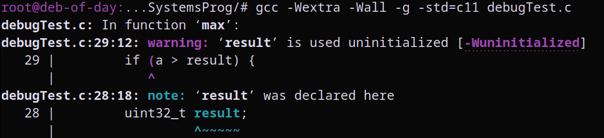

Tue 20 Feb 16:06:07 WET 2024

The main issue with this code is the initialization of variables without
value attribution. We are starting a variable called 'result' but we're not
assigning it any value at all.

The value of result is '0' at the start because everything below the stack is
'zeroed out', meaning that it gets filled with zeros.

Then, result becomes 100 as a consequence of the program logic.

When adding a printed line at the start, and then going through the debugger, we can see that at a point in time, result actually has the value of 32767. This makes it so that the second if statement also prints its contents, and thus we get the second unexpected result.

Incredibly interesting.

Apparently, this is happening because that line is placing all those values on
the stack and it happens that the memoty position of 'result' is then occupied by that garbage value, which is greater than our tests, so actually interferes with them...

Initialize your variables!

--snip--

Side note: the need to initialize the variable would have been made clear if we had compiled the script with extra warnings:

. gcc -Wextra -Wall -g -std=c11 debug.c

As soon as we compile the code we get a warning, stating tat 'result' is being used uninitialized (!).

--snip--

Wed 21 Feb 19:34:43 WET 2024

**GNU Debugger -Useful Commands:**

*(gdb)*

. start -  

. run - 

. quit - 

. where - 

. list - 

. break [file:line] if [expression] - 

. watch [expression] - 

. continue (c) - 

. step (s) - 

. next (n) - 

. finish (fin) - 

. info locals - 

. info args - 

. print (p) [expression] - 

--snip--
