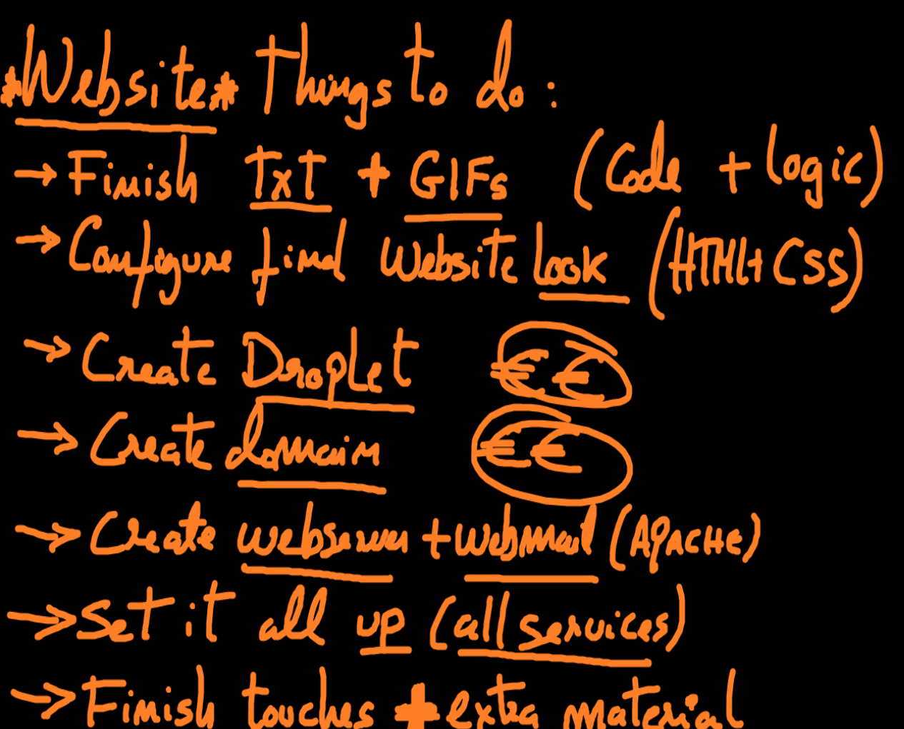
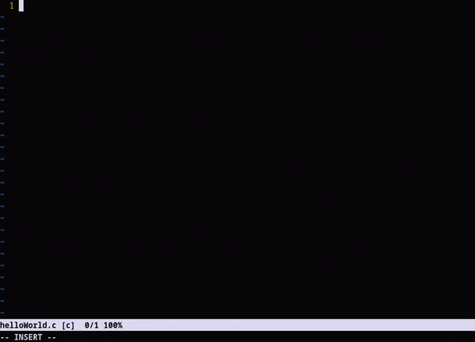
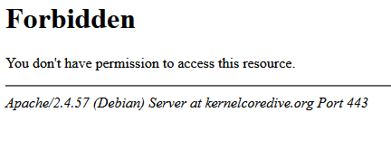
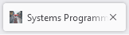

Website: https://www.kernelcoredive.org

Mon 26 Feb 22:19:54 WET 2024

Notes and materials regarding a class project. 
The idea is to create a simple website with html and css on whatever subject I want.
I will be creating this website on the cloud. A proper, albeit simple website, that will focus on systems programming. This is a subject that I am myself learning, so it might be a good excuse to organize my materials and thoughts on the matter.

--snip--

Tue 27 Feb 11:04:22 WET 2024

Need to finish writing the gcc and gdb .md files, create and edit the small snippet gifs and then start working on the HTML and CSS.

When that is (mostly) set up, I can create the infraestructure on the cloud to house my webpage.

Need to add a (free) certificate.

Need to buy a (cheap) domain.

Need to take care of basic security needs.

This is being done on a tight schedule.

--snip--

Wed 28 Feb 23:12:22 WET 2024

Added some more text to the gnu file - explaining simple commands that we can do with the gdb.

Need to add another file showcasing what the program is doing from the POV of the debugger

Need to add a short text explaining the stack. What it is, etc. Make it understandable and easy to read.

Also added the file explainingMemoryLeaks.md. 
It's important and relevant to explain a bit more about how memory works, how it can leak and the consequences of that

--snip--

Thu 29 Feb 14:07:43 WET 2024

Other possible avenues to explore (if I have the time for it):

data structures, pointers and memory management, gile I/O, debugging techniques, potimization techniques, concurrency and parallelism, security
Added a folder for docs which are sketch-ready. These only need a little work to be sent to the webpage

--snip--

Fri  1 Mar 18:36:53 WET 2024

Added the current index.html.

Built it from a complex AI template. Started changing it a couple of days ago. Still needs a lot of work.
If possible, I'd rather spend as little time as possible in stuff like css and html, which I find remarkably boring.

So, hooray for AI, I guess.

--snip--

Sat 2 Feb 12:32:01 WET 2024

Note: I need to add more gifs - that are adequate to my project's logic and layout.
Also check for the text length - or make proper boxes to hold text (easy to read, etc). Will need some extra thinking in this regard.
 

--snip--

Sun  3 Mar 16:40:03 WET 2024

Nearly finished with the basic webpage. Still need to set up the rest to make it work
 
--snip--

Added a webpage folder to keep index.html isolated. That folder will connect to the webserver in the cloud. Any changes to the webserver will be updated there as well. Will also add my other windows machine to the fold.

--snip--

Mon  4 Mar 00:35:39 WET 2024

Minor changes to index.html (not visible yet). Cloud not linked to github, yet. Corrected some text typos.

Need to finish connections and create a mailserver (for requests and messages - this is the one part of the website that is not functional).

--snip--

Locked users out of assets folder with htaccess

--snip--

**To Do:**

**- Mailserver.** - Incomplete

**- Multiple Gits pointing towards the same folder.** - consider taking better notes

**- Ready to use .md files need gifs or proper places to be added.**

**- Re-organize the Assembly and Compilation segments. Join them up.**

**- Mobile Optimization (responsive web design). Later Alig8tor.**

**- Add more content; develop YT content; add to site; other media sites.**

**(Like Mithreas said, "it's work").**

--snip--

Noticed issue in html code: opening of scrolldowns is mirrowed between the Assembly and Compiling sections. There's a good reason for it as well, since they are basically clones of each other. Will take a look into it now.

Found the issue. Changing href="#collapse1_0" to 5_0 and then changing just below theid="collapse1_0" to 5_0, and doing the same for the next 3 entries. This makes them unique.
Since I have the site offline (or rather, and for now, a slightly older version of it) I can easily test out code and then push changes to the cloud. Sorted.

-- snip --

Had a tossle with the .htaccess file to make sure that the right permissions were set and nothing was broken.

--snip--

Tue  5 Mar 17:32:02 WET 2024

Changed the logo to one of my making:

--snip--

Removed useless pictures that I don't need, uncluttering the server.

Installed Postfix and had my first attempt at validating incoming mail (for site suggestions, etc). Atm, not working. Will check out next friday.

The server is ready to be presented as is. It's more akin to a proof of concept than a proper site. Things need to be reorganized and I need to step up security.
Only the bare minimum was done.

--snip--

Git ready and pointing towards an alternative folder inside the cloud (backup).

'Public' presentation done. Refer to the previous To-Do's.

--snip--

Wed  6 Mar 10:46:54 WET 2024

**Things that I must add:**

- Crontab for regular backups to the git folder;
- an alias/command for automatically commiting and pushing updates to said folder;
- mailserver (properly configure postfix, at a minimum, and take care of the JS script);
- add Snort for better traffic monitoring. Figure out how it works and what you can do;
- review security implementations;
- add samba or some such alternative for direct connections (to be considered);
- adapt site for mobile viewing;
- re-organize the site structure and presentation;
- add more content and varied content.

--snip--

